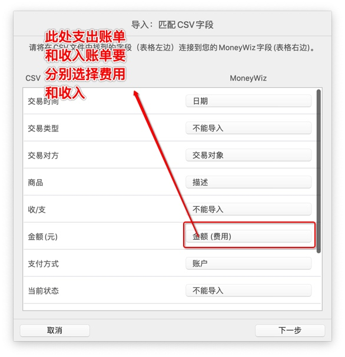

# Moneywiz账单工作流

由于国内几乎不支持同步银行账单，且各类账单文件无法直接导入，因此使用Moneywiz手工记录账务的成本很高。本项目通过Alfred Workflow将账单转为Moneywiz所支持的csv格式文件，方便导入。

## 使用指南

以下内容将帮助你安装并使用Moneywiz账单工作流。

### 安装条件

1. Alfred 2及以上版本，并且Alfred Workflow可用
2. Moneywiz3
3. python2

### 安装

下载地址：[Bill Converter For Moneywiz](https://github.com/chuckiefan/Alfred-Moneywiz-Bill-Importer/blob/master/Bill%20Converter%20For%20Moneywiz.alfredworkflow)

下载完成后双击导入Alfred中，如图：

## 使用方法

1. 微信手机端依次进入：我->支付->钱包->账单->右上角...->账单下载->用于个人对帐，选择账单时间，填写邮箱地址并发送。
2. 在OSX端将邮箱收到的账单下载并解压，通过Finder打开账单所在文件夹（即.csv文件所在文件夹）。
3. 唤出Alfred，输入wxp并回车。

如图：

敲击回车后会生成output文件夹，其中包含三个文件：

使用Moneywiz对收入账单和支出账单进行导入，需要注意的是**收入账单和支出账单的金额类别不同**。

> 目前工作流只支持微信账单，其他类型账单会陆续支持。
 

## 版本说明

### v0.0.1

1. 支持微信收入账单和支出账单的格式转换

## 建议与贡献

创建这个工作流的初衷是为了提高自己的账单管理效率，如果也帮到了您我将非常荣幸。在使用时如果有任何意见或建议欢迎通过issue或者邮件的形式联系我。

邮件地址：chuckiefan@163.com

### 已知问题

在开发和个人使用中遇到问题并记录如下，此列表动态更新。欢迎您联系我寻找更好的解决办法：

* Moneywiz的账单时间目前只支持到日期
* 转账类的账单还请暂时通过手动的方式导入（已在output里对账单类型进行区分），目前还未弄清如何导入转账类型的账单